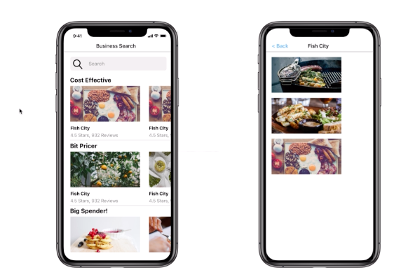

# Restaurant Search App

## User Stories
---
* This is a restaurant search app our application is going to prompt a user with a search bar at the top of the screen.
* Inside there are users going to search for some kind of restaurant.
* Once users get some results from some search API that going to be display those in a series of lists on the screen.
* Each of these are going to be different categories of restaurants that find.
* First present some cheap options so inexpensive restaurants then a little bit pricier.
* And then some expensive restaurants down at the bottom.
* Each of these different sections are going to scroll horizontally.
* So going to allow the user to scroll left to right to see a list of cheap restaurants and then moderate and then expensive once the user taps on a given restaurant were then going to take them to a detail page where it will show them a couple of images from that restaurant on the screen in a kind of list that they can scroll through very easily when a user is on this detail screen. 
* Have a back button to go back to the original search results.

## Technologies Used
---
* React Native
* yelp.com/fusioin

